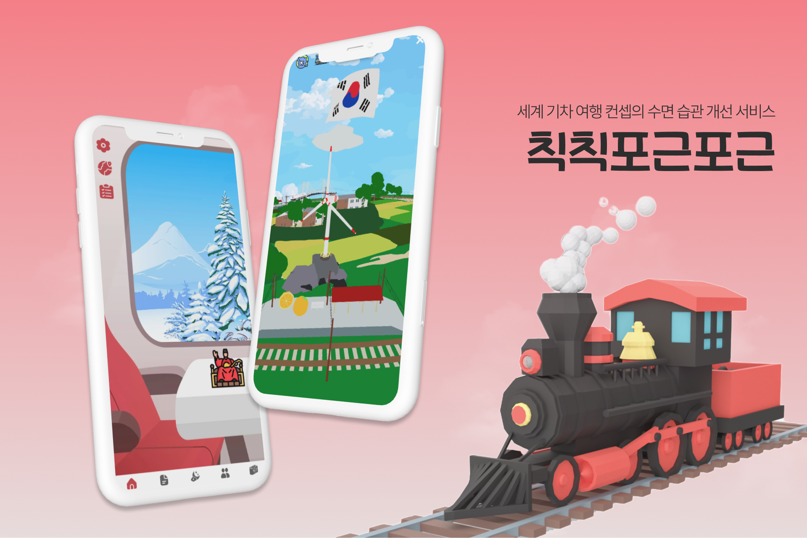
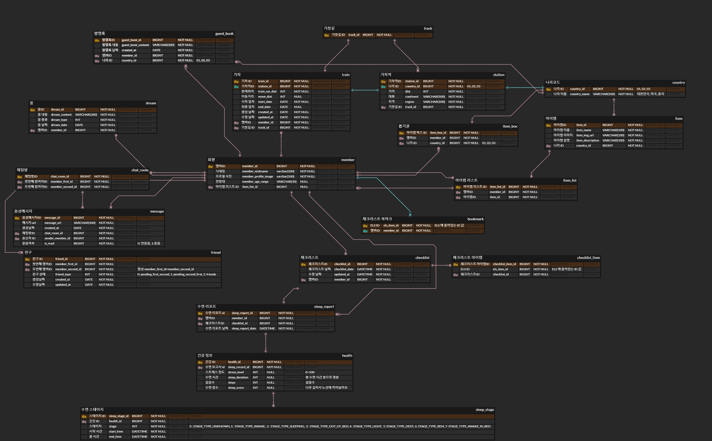
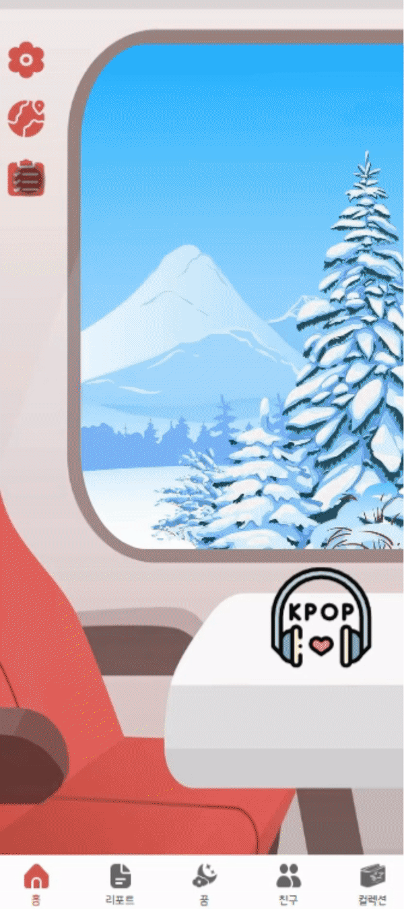
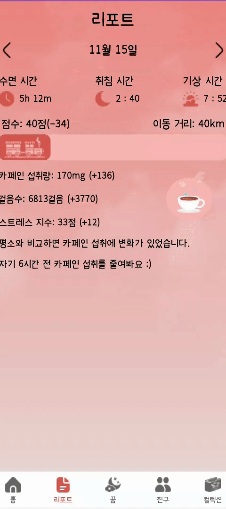
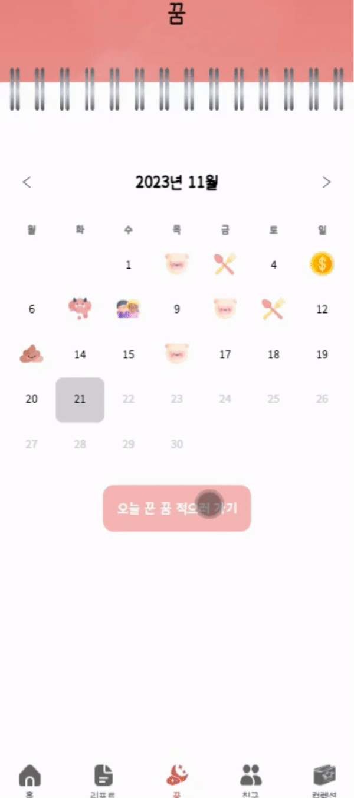
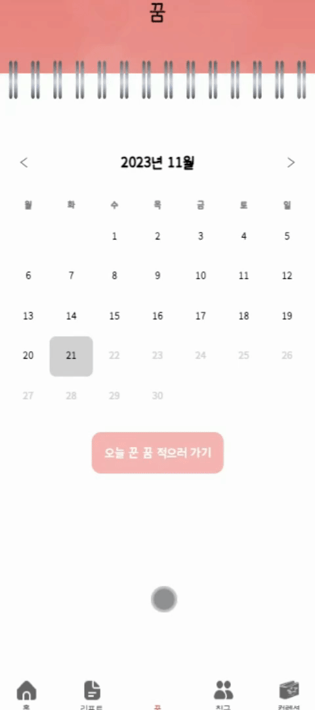
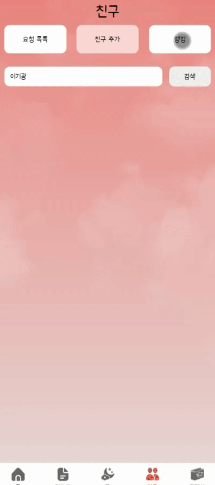
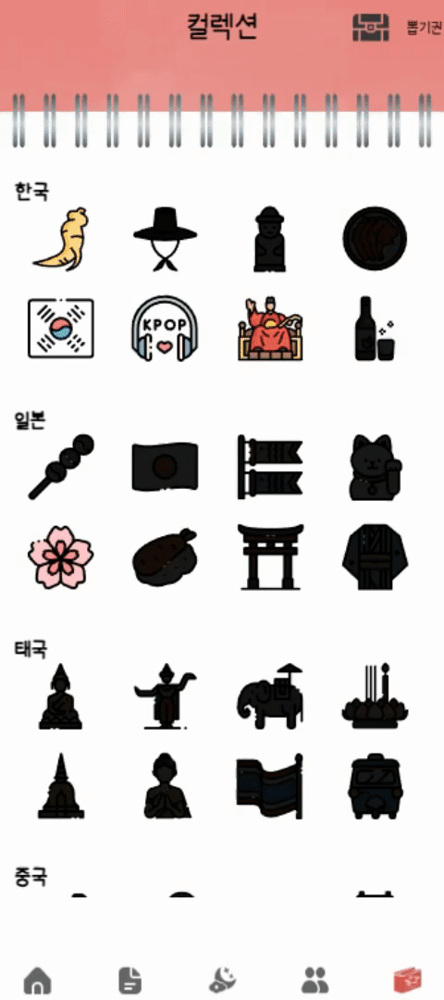

# 칙칙 포근포근
>  기차 세계 여행 컨셉의 수면 습관 개선 서비스  

워치 데이터를 통해 간편하게 수면 데이터를 연동, 수면 데이터를 통해 수면 점수를 분석해줍니다.  
분석 받은 수면 점수를 바탕으로 리포트를 받아보고 기차 여행을 떠나보아요😄

 

## 팀원 소개

|   **Name**   |               이동주👑                 |                강다은                |                  김지홍                   |               이하린                |                 정효인                  |               황주원                |
| :----------: | :-----------------------------------: | :----------------------------------: | :---------------------------------------: | :---------------------------------: | :-------------------------------------: | :---------------------------------: |
| **Profile**  |     |    |         |   |       |   |
| **Position** |          FrontEnd   BackEnd           |          FrontEnd   Mobile           |           BackEnd   Mobile        |        FrontEnd   Mobile         |            BackEnd   Infra           |         Backend   FrontEnd         |
|   **Git**    | [GitHub](https://github.com/emoving) | [GitHub](https://github.com/da010228) | [GitHub](https://github.com/kjh95044) | [GitHub](https://github.com/harinplz) | [GitHub](https://github.com/HyoinJeong) | [GitHub](https://github.com/woneee99) |

 

## 주요 기능
### 기차 여행 컨셉
- 기차 내부의 메인 화면을 통해 현재 도시를 알 수 있다.
- 전체 지도와 대륙 별 국가, 도시를 모델링하여 사용자의 현재 위치 및 전체 지도를 제공한다.

### 수면 리포트 
- 카페인, 총 수면 시간, 수면 단계, 걸음 수, 스트레스에 따라 분석 후 수면 리포트를 제공한다.
- 다중 회귀 분석을 통해 다른 데이터간의 관계를 분석하여 사용자에게 피드백을 제공한다.

 

## 추가 기능

#### 체크 리스트
- 음료 검색 후 등록
- 수면 분석의 카페인 섭취량에 사용

#### 꿈 기록 
- 꿈 종류에 따른 꿈 일기 작성
- 꿈 캘린더

#### 친구 
- 친구와 나의 거리를 비교하여 경쟁
- 음성 메시지를 통한 소통

#### 컬렉션 
- 도시마다 나라 뽑기권 제공
- 뽑기 아이템은 여행에 소지할 수 있음

   

## ERD

 

## 아키텍쳐

 

## 시연 시나리오

### 시작화면

    &nbsp;

 

- 오늘 측정된 수면 리포트를 받을 수 있다.
- 전문가의 조언을 받아 선정된 요소인 카페인, 규칙적인 수면, 걸음 수를 기반으로 수면 리포트를 생성한다.

### 메인화면

    &nbsp;

 

- 현재 위치의 창 밖 풍경 확인이 가능하다. (초기 위치는 서울)
- 구름이 움직이는 애니메이션을 통해 기차가 움직이는 효과를 받을 수 있다.

 

### 마이페이지

    &nbsp;

 

- 사용자의 프로필 사진, 이름, 기차의 총 이동거리, 기차의 현재 위치를 확인할 수 있다.
- 사용자의 프로필 사진을 클릭하면 사진을 변경할 수 있다.

 

### 체크리스트

    &nbsp;

 

- 매장별로 카페인이 들어간 음료의 용량, 칼로리, 당류를 확인할 수 있다.
- 오늘 섭취한 음료를 추가할 수 있으며 목록에서 삭제도 가능하다.
- 자주 마시는 음료는 즐겨찾기 등록을 통해 쉽게 추가할 수 있다. 

 

### 수면리포트

    &nbsp;

 

- 날짜별 수면 리포트를 확인할 수 있다.
- 오늘의 수면 정보(수면 시간, 취침 시간, 기상 시간을)와 카페인 섭취량, 걸음 수, 스트레스 지수를 확인할 수 있다.
- 수면 정보를 바탕으로 계산된 수면 점수, 기차의 이동 거리, 조언을 통해 사용자는 자신의 수면 습관을 개선할 수 있다

 

### 꿈 일기

    &nbsp;

    &nbsp;

 

- 달력 형태로 꿈 작성 여부를 조회할 수 있다.
- 당일에만 꿈 작성이 가능하며, 꿈의 종류에 따라 메인 아이콘이 변경된다.
- 꿈의 종류와 내용을 작성하면 달력의 날짜 아이콘이 변경된다. 

 

### 친구

    &nbsp;

    &nbsp;

 

- 같이 참여하고 경쟁하고 싶은 친구를 추가할 수 있다.
- 닉네임으로 친구를 검색한 후 친구 요청을 보낼 수 있다. 이 때 친구의 현재 기차 위치를 알 수 있다.
- 기차의 거리 순으로 랭킹을 조회할 수 있으며, 서로 음성 메시지를 보내며 대화할 수 있다.

 

### 컬렉션

    &nbsp;

 

- 각 나라의 뽑기권을 사용하면 해당 나라의 8개의 컬렉션 중 1개를 랜덤으로 획득할 수 있다.
- 뽑은 컬렉션의 '가지고 다니기' 버튼을 클릭하면 메인화면에 장착된다.

 

### 지도

    &nbsp;

    &nbsp;

    &nbsp;

 

- 현재 기차 위치에 따라 순차적으로 맵이 열린다.
- 수면 리포트를 기준으로 기차가 해당 거리만큼 움직인다.
- 국기를 클릭하면 해당 나라의 정보를 확인할 수 있으며, 방명록을 등록할 수 있고 다른 사람의 방명록을 랜덤으로 1개 확인할 수 있다.
- 해당 맵의 랜드마크 클릭 시 상세 설명을 확인할 수 있다.
- 기차 아이콘을 클릭하면 현재 기차의 위치를 알 수 있고 해당 기차가 존재하는 나라로 이동이 가능하다. 

 

## 개발 설정
[포팅 메뉴얼(메인 서버)](https://github.com/harinplz/CozyTrain/blob/master/exec/1.%20%EB%B9%8C%EB%93%9C%20%EC%8B%9C%20%EC%82%AC%EC%9A%A9%EB%90%98%EB%8A%94%20%ED%99%98%EA%B2%BD%20%EB%B3%80%EC%88%98%20%EB%93%B1%EC%9D%98%20%EC%A3%BC%EC%9A%94%20%EB%82%B4%EC%9A%A9%20%EC%83%81%EC%84%B8%20%EA%B8%B0%EC%9E%AC/%ED%8F%AC%ED%8C%85%EB%A9%94%EB%89%B4%EC%96%BC(%EB%A9%94%EC%9D%B8%EC%84%9C%EB%B2%84).pdf)

[포팅 메뉴얼(ELK 서버)](https://github.com/harinplz/CozyTrain/blob/master/exec/1.%20%EB%B9%8C%EB%93%9C%20%EC%8B%9C%20%EC%82%AC%EC%9A%A9%EB%90%98%EB%8A%94%20%ED%99%98%EA%B2%BD%20%EB%B3%80%EC%88%98%20%EB%93%B1%EC%9D%98%20%EC%A3%BC%EC%9A%94%20%EB%82%B4%EC%9A%A9%20%EC%83%81%EC%84%B8%20%EA%B8%B0%EC%9E%AC/%ED%8F%AC%ED%8C%85%EB%A9%94%EB%89%B4%EC%96%BC(ELK%20%EC%84%9C%EB%B2%84).pdf)

 

## 사용 예시
[사용 예시](https://github.com/harinplz/CozyTrain/blob/master/exec/3.%20%EC%8B%9C%EC%97%B0%20%EC%8B%9C%EB%82%98%EB%A6%AC%EC%98%A4/%EC%8B%9C%EC%97%B0%20%EC%8B%9C%EB%82%98%EB%A6%AC%EC%98%A4.pdf)

[UCC](https://www.youtube.com/watch?v=dGGt7w4j8eI&ab_channel=HyoinJeong)
